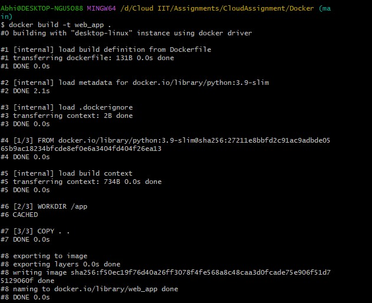
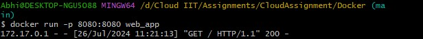
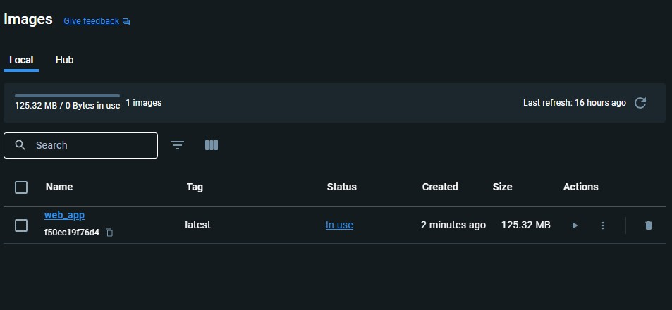
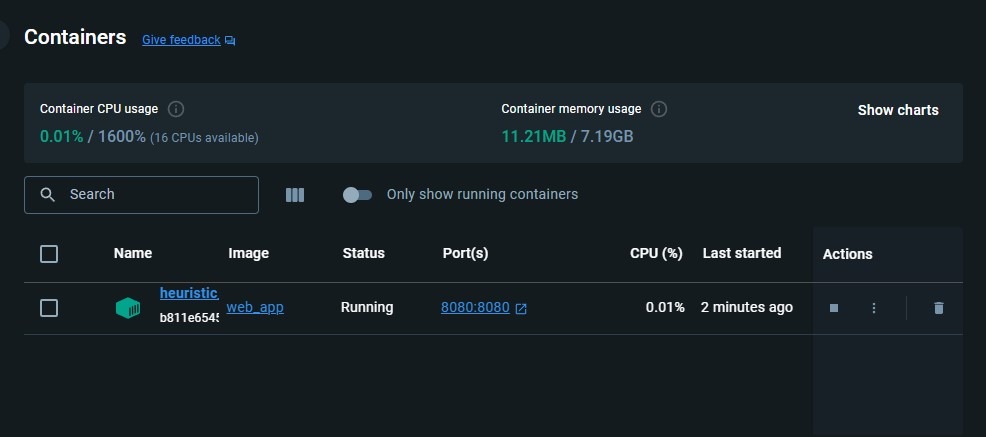
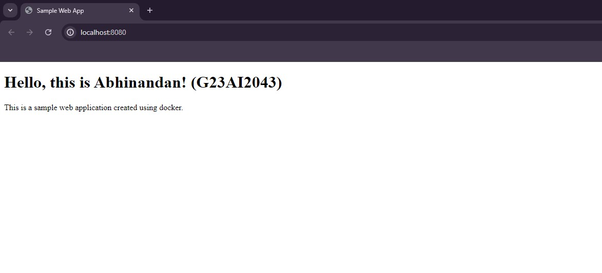

# Create a web application using Docker from scratch

## Description
This project demonstrates setting up a Python server locally to serve static files (index.html and styles.css). Additionally, it includes instructions on Dockerizing the static website .

## Setup

Follow these steps to set up and run the static web server and Dockerized webpage:

### 1. Set Up the Python Web Server

First, set up the Python web server using `server.py` to serve static files:

```
# Clone the repository
git clone https://github.com/g23ai2043/CloudAssignment.git
cd Docker/

```

### 2. Run docker build command

```
# Run the docker build image command 
docker build -t web_app .
```
<p align="center">
  
</p>
### 3. Run docker image

```
# Run the docker image exposing mapping port 8080 to 8080
docker run -p 8080:8080 web_app
```
<p align="center">
  
</p>
We can see that the image and container has been created in docker desktop.
<p align="center">
  
</p>

<p align="center">
  
</p>

### 4. Open localhost on port 8080 in the browser
```
# Open browser and search for localhost
http://localhost:8080
```
<p align="center">
  
</p>
